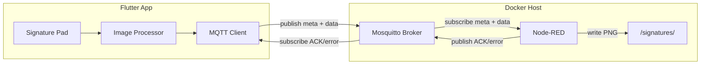
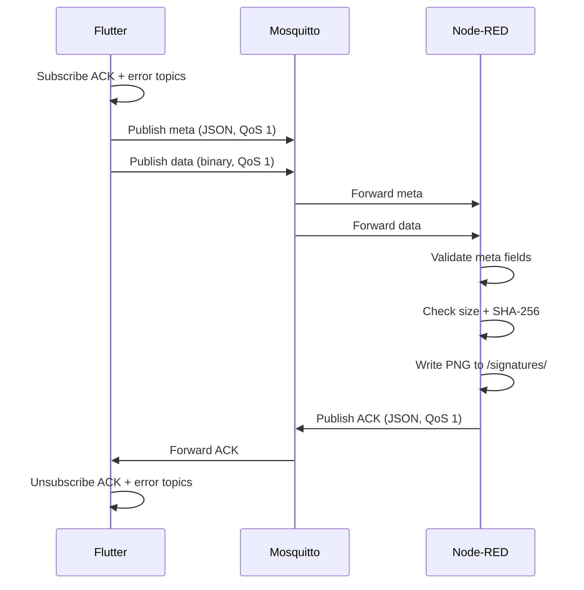
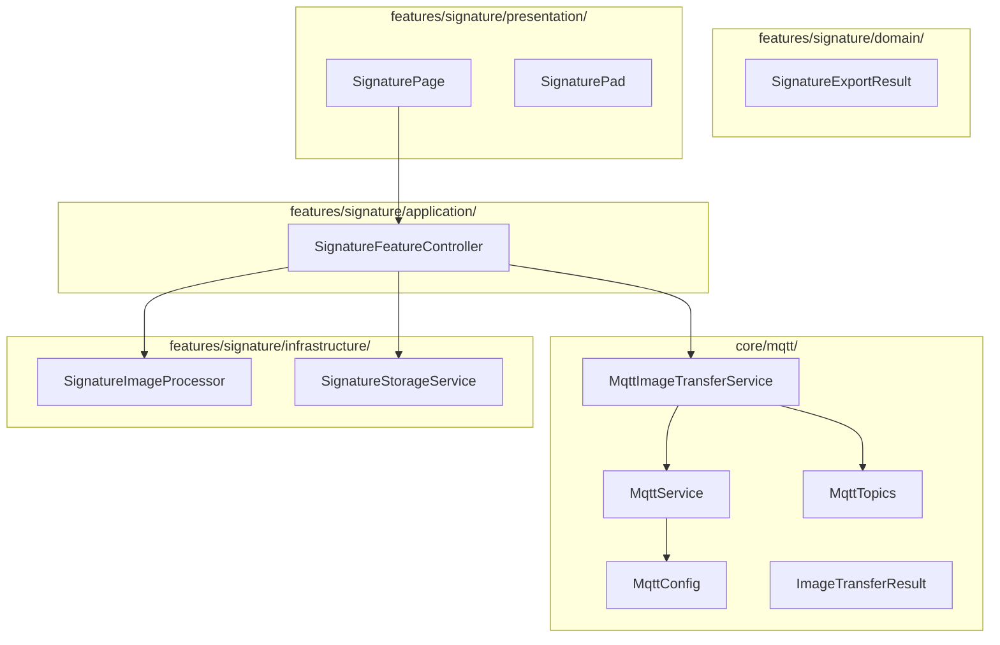
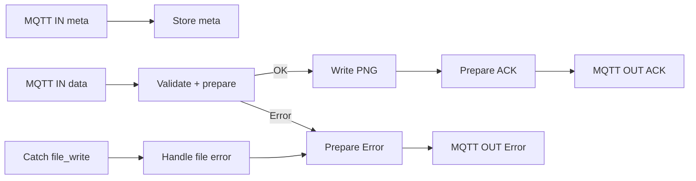

# POC Sign

Proof of concept pour la capture de signatures manuscrites sur mobile et leur transmission en temps reel vers un serveur via MQTT.

**Stack** : Flutter -- Mosquitto (MQTT broker) -- Node-RED -- Docker

---

## Architecture globale



| Service | Role |
|---------|------|
| **Flutter App** | Capture la signature, la traite (crop, resize 256x256), la sauvegarde localement, et la publie sur le broker MQTT. Attend un ACK ou une erreur en retour. |
| **Mosquitto** | Broker MQTT v3.1.1. Relaye les messages entre l'app Flutter et Node-RED. Port TCP 1883, WebSocket 9001. Authentification anonyme. |
| **Node-RED** | Recoit les images via MQTT, valide leur integrite (taille, SHA-256), ecrit le PNG sur le filesystem host, et publie un ACK ou une erreur. |

---

## Communication inter-services

### Flux de transfert d'image



### Topics MQTT

Namespace : `educacode/v1`

| Topic | Direction | Format | QoS | Description |
|-------|-----------|--------|-----|-------------|
| `educacode/v1/devices/{deviceId}/images/{imageId}/meta` | Flutter -> Node-RED | JSON | 1 | Metadonnees de l'image |
| `educacode/v1/devices/{deviceId}/images/{imageId}/data` | Flutter -> Node-RED | Binary buffer | 1 | Contenu PNG brut |
| `educacode/v1/devices/{deviceId}/images/{imageId}/ack` | Node-RED -> Flutter | JSON | 1 | Confirmation de reception |
| `educacode/v1/devices/{deviceId}/images/{imageId}/error` | Node-RED -> Flutter | JSON | 1 | Erreur de traitement |

### Payload meta

```json
{
  "imageId": "1781274339976-e9f95b",
  "fileName": "signature.png",
  "mimeType": "image/png",
  "size": 6668,
  "sha256": "a1b2c3...64 chars hex",
  "encoding": "binary",
  "transferMode": "single",
  "createdAt": "2026-06-12T14:25:39.976Z"
}
```

### Payload ACK

```json
{
  "imageId": "1781274339976-e9f95b",
  "status": "completed",
  "sha256Verified": true,
  "storedPath": "/signatures/1781274339976-e9f95b.png"
}
```

### Payload error

```json
{
  "imageId": "1781274339976-e9f95b",
  "status": "error",
  "reason": "checksum_mismatch"
}
```

Raisons d'erreur possibles : `meta_not_found`, `image_id_mismatch`, `invalid_mime_type`, `invalid_transfer_mode`, `invalid_encoding`, `invalid_size`, `image_too_large`, `invalid_sha256`, `payload_not_buffer`, `size_mismatch`, `checksum_mismatch`, `file_write_failed`.

### Principes de communication

- **Pas de retain** : les messages ne sont pas persistes sur le broker.
- **Pas de chunking** : les PNG font entre 10 et 100 KB, bien en dessous de la limite de 128 KB. Un seul message MQTT par image.
- **Subscribe-before-publish** : Flutter s'abonne aux topics ACK/error avant de publier meta et data, pour eviter de rater une reponse rapide.
- **Timeout** : Flutter attend la reponse pendant 10 secondes maximum.
- **QoS 1** : garantit la livraison au moins une fois. Le flow Node-RED est idempotent pour gerer les doublons.

---

## Architecture Flutter



### Flux de traitement

1. L'utilisateur dessine sur le `SignaturePad`
2. Au tap "Valider", le `SignatureController` exporte les points en PNG brut
3. Le `SignatureImageProcessor` crop le contenu visible, resize proportionnellement, et centre dans un canvas 256x256
4. Le `SignatureStorageService` sauvegarde le PNG dans le repertoire temporaire du device
5. Le `MqttImageTransferService` valide le PNG (magic number, taille <= 128 KB), calcule le SHA-256, publie meta + data, et attend l'ACK
6. Le `SignaturePage` affiche le resultat dans un snackbar (confirme, timeout, ou erreur)

### Fichiers cles

| Fichier | Responsabilite |
|---------|---------------|
| `mqtt_config.dart` | Parametres de connexion MQTT (host, port, clientId) |
| `mqtt_service.dart` | Wrapper autour de `MqttServerClient` : connect, publish, subscribe, unsubscribe |
| `mqtt_topics.dart` | Generation centralisee des topics MQTT |
| `mqtt_image_transfer_service.dart` | Orchestration de l'envoi PNG : validation, hash, publish, await ACK |
| `image_transfer_result.dart` | Modele de resultat : `completed`, `error`, `timeout` |
| `signature_image_processor.dart` | Crop, resize, centrage du PNG en 256x256 |
| `signature_controller.dart` | Coordination export + save + publish + retour du statut |

---

## Architecture Node-RED

Le flow **Signature Receiver** contient 13 noeuds :



### Validations

Le noeud **Store meta** :
- Parse `deviceId` et `imageId` depuis le topic
- Verifie la coherence `meta.imageId` vs topic
- Stocke avec cle composite `meta_{deviceId}_{imageId}`
- TTL de 60 secondes (auto-nettoyage)

Le noeud **Validate + prepare** :
- Verifie que le payload est bien un `Buffer`
- Validation stricte du meta : `mimeType`, `transferMode`, `encoding`, `size` (entier, > 0, <= 128 KB), `sha256` (hex 64 chars)
- Compare `buffer.length` vs `meta.size`
- Calcule et compare le hash SHA-256
- Ecrit le fichier seulement apres toutes les validations

### Robustesse

| Mecanisme | Description |
|-----------|-------------|
| Cle composite | `meta_{deviceId}_{imageId}` evite les collisions entre devices |
| TTL meta | Les meta expirent apres 60s si le data n'arrive jamais |
| Idempotence QoS 1 | Les images deja traitees sont tracees (`completed_` key, TTL 5 min). Un doublon est ignore silencieusement. |
| Retry meta | Si data arrive avant meta, attente de 2 secondes avant de declarer `meta_not_found` |
| Catch file write | Un noeud Catch capture les erreurs d'ecriture fichier et publie une erreur MQTT |

---

## Prerequisites

- [Docker](https://docs.docker.com/get-docker/) et Docker Compose
- [Flutter SDK](https://docs.flutter.dev/get-started/install) >= 3.12.1
- [VS Code](https://code.visualstudio.com/) ou [Cursor](https://cursor.sh/) avec l'extension Dart/Flutter
- Un appareil Android physique ou un emulateur

---

## Demarrage rapide

### 1. Lancer l'infrastructure

```bash
docker compose up -d
```

Cela demarre Mosquitto (ports 1883/9001) et Node-RED (port 1880).

### 2. Deployer le flow Node-RED

**Option A** -- Import manuel via l'UI :
1. Ouvrir http://localhost:1880
2. Menu hamburger > Import
3. Coller le contenu de `nodered/flows/signature_receiver.json`
4. Deploy

**Option B** -- Via l'API admin :

```bash
# Recuperer les flows existants et merger avec le nouveau
python3 -c "
import json, urllib.request

with urllib.request.urlopen('http://localhost:1880/flows') as r:
    current = json.loads(r.read())

with open('nodered/flows/signature_receiver.json') as f:
    new_nodes = json.load(f)

data = json.dumps(current + new_nodes).encode()
req = urllib.request.Request('http://localhost:1880/flows', data=data, method='POST')
req.add_header('Content-Type', 'application/json')
req.add_header('Node-RED-Deployment-Type', 'full')
urllib.request.urlopen(req)
print('Flow deployed')
"
```

### 3. Preparer le repertoire de sortie

```bash
mkdir -p signatures
```

### 4. Lancer l'application Flutter

Ouvrir le projet dans VS Code / Cursor et lancer avec F5. Le `preLaunchTask` execute automatiquement `detect_host_ip.sh` pour generer l'IP du host dans `mqtt_host.g.dart`.

Alternativement, en ligne de commande :

```bash
cd front
./scripts/detect_host_ip.sh
flutter run
```

---

## Configuration

### Detection de l'IP host

Le script `front/scripts/detect_host_ip.sh` detecte l'IP locale de la machine et genere `front/lib/core/mqtt/mqtt_host.g.dart` :

```dart
const String mqttHostIp = '192.168.1.42';
```

Ce fichier est gitignore et regenere a chaque lancement via le `preLaunchTask` de VS Code.

### Mosquitto

| Parametre | Valeur |
|-----------|--------|
| Port TCP | 1883 |
| Port WebSocket | 9001 |
| Authentification | Anonyme |
| Config | `mosquitto/config/mosquitto.conf` |

### Node-RED

| Parametre | Valeur |
|-----------|--------|
| Port UI | 1880 |
| User Docker | 1000:1000 |
| Volume data | `nodered_data` (Docker volume) |
| Volume signatures | `./signatures:/signatures` (bind mount) |

---

## Structure des fichiers

```
poc_sign/
├── docker-compose.yml
├── mosquitto/
│   └── config/
│       └── mosquitto.conf
├── nodered/
│   └── flows/
│       └── signature_receiver.json
├── signatures/
│   └── .gitkeep
├── .vscode/
│   ├── launch.json
│   └── tasks.json
└── front/
    ├── pubspec.yaml
    ├── scripts/
    │   └── detect_host_ip.sh
    └── lib/
        ├── main.dart
        ├── core/
        │   └── mqtt/
        │       ├── mqtt_config.dart
        │       ├── mqtt_service.dart
        │       ├── mqtt_topics.dart
        │       ├── mqtt_image_transfer_service.dart
        │       └── image_transfer_result.dart
        └── features/
            └── signature/
                ├── domain/
                │   └── signature_export_result.dart
                ├── infrastructure/
                │   ├── signature_image_processor.dart
                │   └── signature_storage_service.dart
                ├── application/
                │   └── signature_controller.dart
                └── presentation/
                    ├── signature_page.dart
                    └── signature_pad.dart
```
